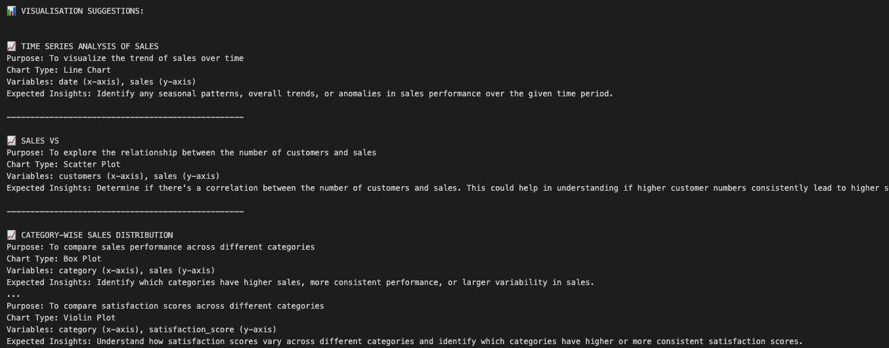
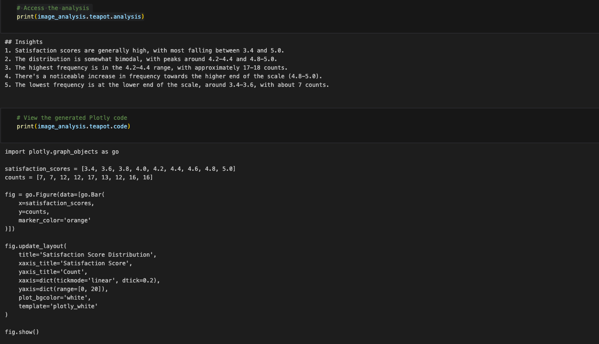
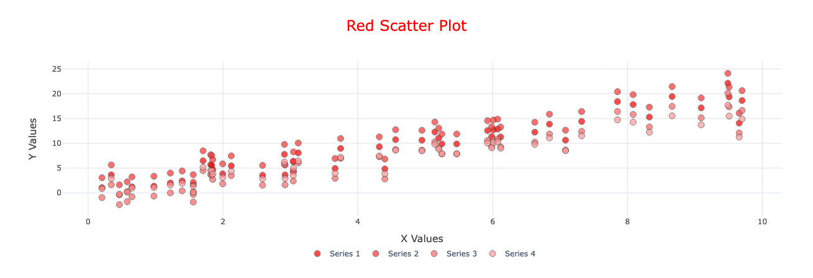

# chAI
An LLM-powered charting package to enable visualisation suggestion, image review and analysis, copycat functionality to replicate a provided chart in plotly, and output of standardised plotly code for bar, histogram, scatter and line charts.

Currently the library has only been tested with compatible Anthropic models. See the [AWS documentation](https://docs.aws.amazon.com/bedrock/latest/userguide/models-supported.html) for models that have compatible input modalities for image analysis.


## Prerequisites
- An environment with Python 3.11 or greater
- Foundation model access approved within AWS for models referenced in constants.py
- OPTIONAL: A .env file with an entry for AWS_PROFILE=. This profile/user should have sufficient permissions to execute a API calls without requiring MFA authentication in e.g. a notebook. Alternatively, users can configure the chAI runtime at initialisation.

## Installation
To use chAI:
- Create and activate a new virtual environment with Python 3.11 or greater
- Ensure you are in the root folder of the repo
- In the terminal type:

```pip install git+https://github.com/co-cddo/gds-idea-chai.git```

You can now use chAI in your python notebook!

## Usage
chAI comes with 3 LLM requests by default. To initialise chAI you can either set up a .env file with the following variables:
- AWS_PROFILE=your-aws-profile
- LLM_REGION=your-aws-region
- LLM_MODEL=your-chosen-model

and then run:
```
from chai import chAI
chai = chAI()
```

Alternatively for more flexibility, you can provide the variables yourself:
```
chai = chAI(
    aws_profile="your-aws-profile", 
    llm_region="us-east-1", 
    llm_model="CLAUDE_SONNET_3_5"
)
```

Refer to the chAI_functionality_examples.ipynb notebook to see the workflows in action. A sample input chart is provided for you to experiment with.

### Intelligent Visualisation Recommendations
This takes an input dataframe and reviews the first 100 rows of data to suggest potential visualisations for analysis. For each suggested chart:
- Purpose: This section outlines the goal of the visualisation. It describes what the chart is meant to show.
- Chart Type: This specifies the suitable visual you will use to present the data.
- Variables: This section defines the data being plotted on the x and y axes.
- Expected Insights: This part describes the specific insights you may gain from the visualisation.

```
# Example Code
sample_df = create_sample_dataset()
prompt = "Analyse this dataset and suggest visualisations to explore trends and insights."
response = chai.steep(
    data=sample_df,
    prompt=prompt,
)
print(response.teapot.suggestions)
```


### Chart Analysis and Replication with chAI
This takes a stored PNG image and attempts to 1. replicate the image using plotly into an HTML file 2. analyse the image. The analytical review can be boosted by providing some additional context as to what the image might show (for example the chart relates to outcomes of a specific subset of data).
This returns a JSON dictionary containing:
- analysis: A summary of what the LLM's analytical review
- code: The plotly code required to replicate the "look" of the chart (or as close as possible)
- path: The path where the HTML file has been saved

```
# Example Code
prompt = """
    Please analyse this chart and provide a comprehensive review with the following structure:

    1. Key Findings:
    - What are the most significant patterns or insights?
    - What are the highest and lowest values?
    - Are there any notable disparities or trends?

    2. Comparative Analysis:
    - Compare the different outcome groups
    - Identify any significant gaps or differences
    - Highlight any unexpected patterns

    Please provide your analysis in clear, business-friendly language suitable for stakeholders.
    """
image_analysis = chai.steep(prompt=prompt, image_path="../tests/img/satisfaction.png")
print(image_analysis.teapot.analysis) # Access the analysis
print(image_analysis.teapot.code) # View the generated Plotly code
print(image_analysis.teapot.path) # View the path to the locally generated chart
```


### Chart Template Generation
chAI has plotly code for several chart templates in its backend:
- Bar
- Histogram
- Scatter
- Line

chAI can take user prompts to design a specified chart and provide required plotly code.

```
# Example Code
chart_prompt = "I want a red chart with bold axis titles and labels on the bars. There should also be a legend showing each distinct category"
chart_generation = chai.steep(prompt=chart_prompt, chart_type="scatter")
print(chart_generation.teapot.code) # View the generated Plotly code
```



## Development
The project uses [uv](https://docs.astral.sh/uv/) for development. To contribute:

```
git clone https://github.com/co-cddo/gds-ideas-chai.git
cd gds-ideas-chai
uv sync --dev 
```